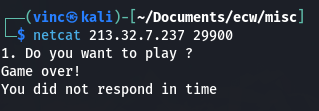
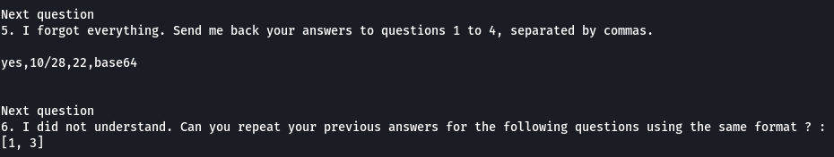

# ECW 2022 Write Up

## MISC - Jigsaw

Aaaaah Jigsaw... peut être un des chall les plus marrants du ctf et pourtant sans aucun doute l'un des plus rageant.
Le challenge se présentait en trois parties - trois flags à récupérer qui étaient gracieusement donnée lors de certaines réponses correctes.
Il y avait au total 10 questions (11 étaient prévus mais dieu merci Seela a eu pitié de nous et nous a épargné la dernière).

### Jigsaw 1/3 - 259 solves - 100 pts


Une fois la docker démarré on peut se connecter sur l'interface web pour observer la première question:

### Question 1


A priori impossible pour nous de répondre à la question.
Il n'est pas rare d'observer ce genre de situation dans un ctf. En fait, ce genre de cas arrive lorsque le serveur communique via TCP. Le navigateur envoie une requête simple et retourne la première réponse du serveur (souvent à moitié incompatible). Puis, étant donnée la nature unique des requêtes HTTP, la connexion TCP se ferme automatiquement à la suite de cet échange. Nous devons donc essayer de garder cette connexion ouverte.
Nous allons ouvrir une connexion TCP avec le serveur et la maintenir ouverte, rien de plus simple avec l'outil netcat :

```bash
netcat [IP] [PORT]
```



La connexion s'ouvre bien, et reste visiblement ouverte un temps avant d'être fermé par le serveur :'(  
Nous avons visiblement un temps maximum pour répondre à chaque question !
Cette théorie est vite validé lorsque l'on répond à la première question :


### Question 2

Il nous faut désormais trouver le nom de la plus longue piste d’atterrissage de l'aéroport de Rennes. Si vous n'avez pas eu l'occasion de chercher par vous même et que vous avez un peu de temps devant vous je vous invite fortement à essayer de résoudre cette petite mission (un brin d'osint ne fait jamais de mal).
Personnellement cette question m'a pris beaucoup plus de temps qu'elle n'aurait dû !

--> Soluce :
En cherchant sur Google on arrive facilement à trouver que la "piste principale" fait 2100 mètres, et qu'une extension de sa longueur de 300 mètres est envisagée. J'ai bien essayé "piste principale" mais rien n'y fait pas l'ombre d'un nom...
Finalement en se perdant se OpenStreetMap je suis tombé la dessus :


En prenant un peu de recul je me suis rendu compte que Wikipédia y faisait aussi allusion :
```
L'aéroport dispose de 2 pistes en enrobé : 28/10 (2 100 m) et 32L/14R (850 m).
```
Visiblement c'est trop demandé pour un aéroport de disposer d'un nom parlant pour leur piste d’atterrissage ...
La réponse est donc bien : 10/28


### Question 3

Ah ! Ça se [corse](https://www.lefigaro.fr/langue-francaise/expressions-francaises/2017/12/10/37003-20171210ARTFIG00002-mais-pourquoi-ca-se-corse-quand-tout-se-complique.php) !

En réessayant ces questions à de multiples reprises on observe que le calcul mathématique change systématiquement. Bien que n'étant pas une quiche en calcul mental je me dis qu'un petit script ne ferait de mal à personne, d'autant plus que nous n'en sommes qu'à la troisième question. Qui sait ce qui va nous attendre ensuite (sploiler : ça va s'empirer).

Pour scripter tout ça nous allons nous servir de la librairie [socket](https://docs.python.org/fr/3/howto/sockets.html) de python. Pour le moment nous avons quelque chose qui ressemble à ça :
```Python
import sys
import socket

if len(sys.argv) != 3:
	print("Usage : python3 jigsaw.py [IP] [PORT]")
	exit()

# Ouverture de la connexion TCP
TCP_IP = sys.argv[1]
TCP_PORT = int(sys.argv[2])
BUFFER_SIZE = 1024
s = socket.socket(socket.AF_INET, socket.SOCK_STREAM)
s.connect((TCP_IP, TCP_PORT))
print(str(s.recv(BUFFER_SIZE), "utf-8"))

# Fonction d'envoie de message
def sendmessage(reponse):
	print(reponse)
	s.send(reponse.encode())
	time.sleep(0.1) # On attend la réponse du serveur
	data = s.recv(BUFFER_SIZE)
	output = str(data, "utf-8")
	print(output)
	return output

# Question 1 et 2 :
sendmessage("yes")
sendmessage("10/28")
exit()
```

Pour répondre à la question 3 il faut donc récupérer le calcul mathématique, l'interpréter et ensuite renvoyer le résultat. En réessayant plusieurs fois on observe que les calculs, relativement faciles, se limitent aux opérations simples. On ajoute donc quelques lignes à notre script :

```Python
# [...]
calc = sendmessage("10/28")

# Question 3 :
calc = calc.split('\n')[4] # On ne récupère que la ligne contenant le calcul
result = eval(calc) # La fonction eval interprète le calcul depuis la string
sendmessage(str(result))
exit()
```


### Question 4

La question 4 commence à être légèrement tordu, visiblement la question est encodée. Il nous faut dans un premier temps la décoder pour en comprendre le sens. Le formidable outil qu'est [CyberChef](https://gchq.github.io/CyberChef/) va le faire pour nous. À l'aide de la baguette magique, CyberChef reconnait automatiquement l'encodage et va le décoder pour nous :


Il nous faut donc reconnaitre l'encodage et envoyer le format comme réponse. Après plusieurs essais on se rend compte que les diverses formes d'encodage possiblement renvoyées par le serveurs sont les suivantes : base16 (#Hexadecimal), base32, base64 et base85 --> On va donc se servir de la librairie base64 de python qui gère tous ces formats.
C'est reparti pour notre petit script !

```Python
# [...]
encoded = sendmessage(str(result))

# Question 4 :
encoded = encoded.split('\n')[3].split('\'')[1] # On ne récupère que la string encodée
for base in ["base16", "base32", "base64", "base85"]:
	try: # Si le message n'arrive pas à être correctement lu c'est que l'encodage est mauvais
		if base == "base16":
			decoded = base64.b16decode(encoded)
		elif base == "base32":
			decoded = base64.b32decode(encoded)
		elif base == "base64":
			decoded = base64.b64decode(encoded)
		elif base == "base85":
			decoded = base64.b85decode(encoded)
		decoded.decode('utf-8')
	except:
		pass
	else:
		break

sendmessage(base)
exit()
```

Victoire ! 


On a débloqué notre premier flag :


### Jigsaw 2/3 - 212 solves - 100 pts
### Question 5

La suite du challenge se fait avec la même instance docker.

Bon cette question ne semble pas bien difficile, étant donné que nous avons tout scripté. Il nous suffit de faire une liste de chacune de nos réponses et d'envoyer les questions demandées au serveur.

```Python
# [...]
# Question 5

answers = ["yes","10/28"]
answers.append(str(result))
answers.append(base)
sendmessage(",".join(answers))
exit()
```



### Question 6

Cette fois ci il suffit de faire le tri dans les réponses qu'on envoie en fonction du tableau d'input qui nous est donné :

```Python
# [...]
# Question 6

repeat = repeat.split('\n')[4] # On récupère la string du tableau d'input
repeat_list = ast.literal_eval(repeat) # On interpète la liste depuis la string
answers_repeat = [answers[i-1] for i in repeat_list] # On selectionne nos réponses
sendmessage(",".join(answers_repeat))
exit()
```


### Question 7

Ah ! On arrive au moment où le script que j'ai pondu à l'arrache ne ressemblait plus à rien. La qualité de mon code représentait assez bien l'état d'esprit dans lequel je me trouvais à ce moment là (et je n'étais pas au bout de mes peines !).


Pour la question 7 il va donc falloir répondre à une question aléatoire parmi les questions précédemment posées.
Cela remet en question l'architecture du code. Pour résoudre le chall le plus vite possible sans me casser la tête j'avais simplement fait une condition par question en testant la présence d'un mot dans la question renvoyée par le serveur. Pour vos beaux yeux je vais re-factoriser mon code avec des fonctions pour éviter la duplication de code.
Une fois le code remanié on peut facilement répondre à la question 7, attention tout de même à la mise en forme (selon la question il ne faut pas lire la même ligne) :

```Python
# [...]
q7 = question6(list_index)

# Question 7
if "Easy maths" in q7: 
	question3(q7.split('\n')[5])	# Question 3 - Opération mathématique
elif "I forgot everything" in q7:
	sendmessage(",".join(answers))	# Question 5 - Liste de réponse
elif "I did not understand" in q7:
	question6(q7.split('\n')[5])	# Question 6 - Liste de réponse avec index
else:
	decoded,_ = question4(q7.split('\n')[4].split('\'')[1]) # Question 4 - Question encodé
	q8 = sendmessage(decoded)
exit()

```


Effectivement avec des fonctions c'est mieux ! Avec cette 7ème question nous débloquons notre deuxième flag !


Malheureusement pour notre santé mental, un flag de trouvé est synonyme d'un nouveau flag à chercher.

### Jigsaw 3/3 - 121 solves - 143 pts
### Question 8

La question 8 commence doucement. Il s'agit de trouver la bonne rotation alphabétique pour retrouver le mot qui à été encodé par un ROT Cypher (autrement appelé code Caesar ou César). On peut vérifier avec notre outil favoris si on retrouve bien un mot à consonance anglaise en procédant à toutes les rotations possibles :


En essayant plusieurs combinaisons on se rend compte que l'offset de rotation change à chaque fois mais, qu'il s'agit toujours d'une rotation alpha. Visiblement les mots encodés proviennent toujours du vocabulaire anglais.
On va donc devoir récupérer un dictionnaire anglais afin de pouvoir tester les 26-1 rotations possibles. En appliquant une rotation de n sur chaque lettre du mot et en vérifiant la présence de ce nouveau mot dans le dictionnaire on peut retrouver le mot d'origine.
Je me suis basé sur ce [dictionnaire](https://github.com/dwyl/english-words/blob/master/words.txt) pour mes tests.
Edd Mann m'a généreusement donné une fonction permettant d'appliquer une rotation alpha de n sur son [site](https://eddmann.com/posts/implementing-rot13-and-rot-n-caesar-ciphers-in-python/)

Voici donc ce que donne ma solution pour cette question :
```Python
# Question 8

# Fonction appliquant une rotation alphabétique de n sur un mot donné
def rot_alpha(n):
	from string import ascii_lowercase as lc, ascii_uppercase as uc
	lookup = str.maketrans(lc + uc, lc[n:] + lc[:n] + uc[n:] + uc[:n])
	return lambda s: s.translate(lookup)

rotated_word = q8.split('\n')[5] # On récupère le mot encodé
dictionary = open("words.txt",'r').read().splitlines() # On charge le dictionnaire

q9 = ""
for i in range(26):
	new_rotated_word = rot_alpha(i)(rotated_word)
	if new_rotated_word in dictionary:
		q9 = sendmessage(new_rotated_word)
		break

# Si le mot n'était pas le bon ou si le mot n'est pas présent dans le dictionnaire
if not "9." in q9:
	exit()
```


### Question 9

Ça y est ! On va pouvoir s'arracher les cheveux !
Pour ce défi je me suis creusé la tête quelque temps, je n'arrivais pas à trouver une solution qui soit optimale.

En réalité pour ce genre de problème deux solutions s'offrent à nous :

- Une des solutions bien connue pour la résolution d'encodage d'algorithme de substitution alphabétique consiste à faire une [analyse fréquentielle](https://fr.wikipedia.org/wiki/Analyse_fr%C3%A9quentielle) sur la moyenne d’occurrence de chaque lettre. On peut ensuite comparer ce nombre avec la moyenne fréquentielle du dictionnaire anglais. On pourrait ainsi retrouver à quelle lettre correspond chaque lettres. Malheureusement l'input fourni par la question est bien trop petit pour faire une réelle étude statistique ...

- La deuxième solution consisterait, à défaut de faire une moyenne statistique, à comparer les occurrences de chaque lettre identiques. À condition bien sûr que dans l'algorithme de substitution utilisé deux lettres identiques soient bien substituées de la même manière. En comparant les index des lettres identiques dans le mot, on peut chercher une correspondance dans tous les mots du dictionnaire. Ainsi, si le mot donné est suffisamment long et possède suffisamment de lettres identiques alors on pourra retrouver le mot d'origine.

Étant donné que nous ne connaissons ni l'algorithme de substitution ni le dictionnaire de mots fourni aléatoirement par le serveur il est impossible de donner une réponse valide dans 100% des cas.
Une des solutions qui permettrait d'optimiser grandement le taux de réussite serait de faire un algorithme d'apprentissage qui, en se basant sur la seconde méthode ci-dessus, garderait en mémoire les mots valide afin de les réutiliser en priorité lorsque les occurrences de lettres identiques correspondent.
Le plus bourrin est souvent plus simple : Le brute-force !
Puisque le serveur répond très vite on peut simplement essayer en boucle des possibilités jusqu'à tomber sur un mot suffisamment long pour être validé !


```Python
# Question 9

# Fonction retournant les index d'une lettre qui se répète dans un mot
def find(string, char):
	return [i for i, ltr in enumerate(string) if ltr == char]

# Fonction cherchant les similitudes d’occurrence de lettres entre le mot et le dictionnaire
def findindict(word, english_dict):
	listefinale = []
	duplicate = []

	# On cherche tous les index de répétition de la même lettre dans un mot
	for letter in word:
		indexes = find(word, letter)
		if len(indexes) >= 2 and indexes not in duplicate:
			duplicate.append(indexes)

	# On compare ces index avec tous les mots du dictionnaire
	for english_word in english_dict:
		if len(word) == len(english_word):
			isgood = True
			for d in duplicate:
				for i in range(1,len(d)):
					if(english_word[d[0]] != english_word[d[i]]):
						isgood = False
			if isgood:
				listefinale.append(english_word)

	# On retourne une des solutions possible aléatoirement
	return listefinale[random.randrange(0,len(listefinale))]

cyphered_word = q9.split('\n')[5]
word = findindict(cyphered_word, dictionary)
q10 = sendmessage(word)

if "bye bye" in q10:
	exit()
```

Au bout d'un certain nombre (beaucoup trop élevé) d'essais on fini par réussir à trouver une des possibilités !


### Question 10

En lisant cette question mon visage s'est décomposé :o  
À première vu, rien de bien compliqué, le mot à trouver a été encodé avec une baseXX, puis avec une substitution alphabétique et enfin avec la même substitution aléatoire que la question 9.
Étant donné la méthode de résolution de la question 9 que j'ai utilisé, le fait que le mot soit encodé avec une substitution aléatoire implique que la rotation alphabétique devient caduc. Nous avons juste à utiliser les fonctions de la question 4 et de la question 9.
Donc tout est facile !
Sauf si on prend en compte la nature aléatoire de la méthode de résolution de la question 9... -\_-\"

Il va falloir valider la question 9 et la question 10 dans une même continuité !

Voici le code pour intégrer le décodage en baseXX et la substitution:

```Python
cyphered_encoded = q10.split('\n')[4].split('\'')[1]
base,cyphered_decoded = question4(cyphered_encoded)
decyphered_decoded= findindict(cyphered_decoded, dictionary)
output = sendmessage(decyphered_decoded)
print(output)
```

Pour provoquer la chance on touche du bois, on encapsule tout notre script dans une boucle while et puis on va chercher son café !
Au bout d'un certain temps, miracle !!


### Bonus - Optimisation

Après avoir laissé notre boucle tourner un bon moment, on peut noter une certaine redondance dans les mots qui sont validés comme réponse correcte.
On peut alors facilement mettre en place de l'apprentissage en enregistrant les réponses de la substitution par rotation (étant donné que c'est la question qui se base sur les inputs inconnus qui donne le plus de réponses valides).
L'apprentissage représente en réalité un nouveau dictionnaire composé des résultats de la question 8 et que l'on utilisera pour la question 9 et 10 :


- Au début du programme on essaye de charger un potentiel apprentissage d'une précédente exécution :
```Python
learn = []
try:
	f = open("learn.txt",'r')
	learn_str = f.read()
	learn = ast.literal_eval(learn_str)
	f.close()
except :
	pass
```

- On fait l'apprentissage sur la validité du mot de la question 8 :
```Python
if not "9." in q9:
	s.close()
	continue
else:
	if new_rotated_word not in learn:
		learn.append(new_rotated_word)
		print(new_rotated_word)
```

- On se sert de l'apprentissage :
```Python
# Pour la question 9 :
word = findindict(cyphered_word, learn)
# Pour la question 10 :
decyphered_decoded = findindict(cyphered_decoded, learn)
```

- On sauvegarde l'apprentissage :
```Python
f = open("learn.txt",'w+')
f.write(str(learn))
f.close()
exit()
```

- On obtient la réponse facilement en moins de 10 essais avec un bon apprentissage grâce à notre super cerveau
